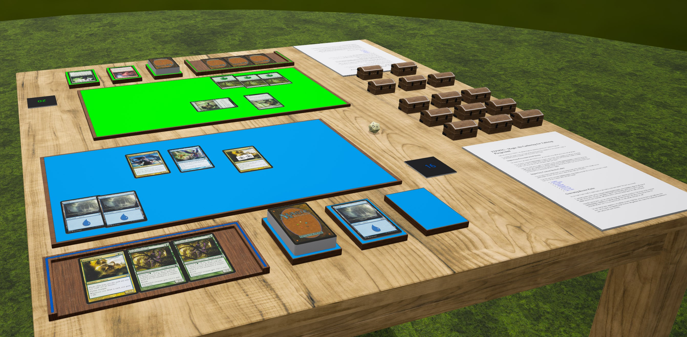

# TTPMTG



This repository contains TTPMTG, the ultimate
[Magic: the Gathering](https://magic.wizards.com/en) experience for
[Tabletop Playground](https://store.steampowered.com/app/838410/Tabletop_Playground/)!

For more information on TTPMTG, take a look at [the manual](Textures/manual.pdf).

# Building

This project doesn't really need "built", per se, except for the manual.
To rebuild the manual, run:

```sh
make
```

# Credits

Special thanks to Plasticity Studios for implementing bugfixes and even feature
additions I asked for! I couldn't have done this without the help of TTP's
wonderful developers.
